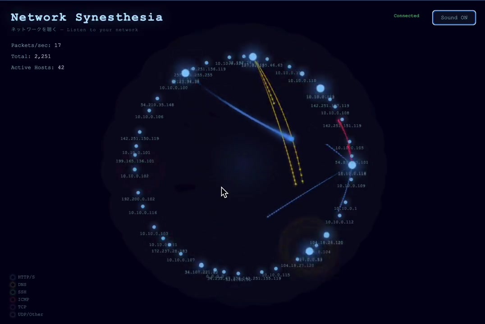

# Network Synesthesia

Real-time network traffic visualization and sonification. Packets become particles of light and musical notes.

## Demo

[](https://github.com/nnnnnnnnnke/network-synesthesia/blob/main/demo.mp4)

*Click the image to watch the demo video (with sound)*

## What it does

- Captures live network packets via `tcpdump` and streams them to the browser via WebSocket
- Each protocol has a unique color and instrument:

| Protocol | Color | Sound |
|----------|-------|-------|
| HTTP/S | Blue | Sine wave pad |
| DNS | Yellow | Bell / Chime |
| SSH | Green | Sawtooth bass |
| ICMP | Red | Percussion |
| TCP | Purple | Sine |
| UDP | Gray | Triangle |

- Packets fly as glowing particles between source and destination hosts
- Pentatonic scale ensures everything sounds harmonious
- Built-in reverb for ambient atmosphere

## Architecture

```
tcpdump → Python (aiohttp) → WebSocket → Browser
                                          ├── Canvas (particles, ripples, host glow)
                                          └── Web Audio API (oscillators, reverb)
```

The Python backend captures raw packets with `tcpdump`, parses protocol/address/size, and broadcasts JSON to all connected browsers via WebSocket. The frontend renders each packet as a glowing particle on Canvas and plays a musical note with the Web Audio API.

## Quick Start

```bash
# Install dependencies
sudo apt-get install -y python3-aiohttp tcpdump dnsutils curl traceroute

# Run the server (requires root for tcpdump)
sudo python3 server.py

# Open http://localhost:3000 in your browser
# Click "Sound ON" to enable audio
```

## Traffic Generator

Generate test traffic to make the visualization more interesting:

```bash
# Run all patterns in a loop
sudo python3 traffic-gen.py auto

# Run a specific pattern
sudo python3 traffic-gen.py heartbeat   # Steady ICMP rhythm
sudo python3 traffic-gen.py storm       # All protocols at once
sudo python3 traffic-gen.py cascade     # ICMP → DNS → HTTP → TCP → UDP wave
sudo python3 traffic-gen.py pulse       # Quiet → burst → quiet → burst
sudo python3 traffic-gen.py exploration # Traceroute + port scan

# Run each pattern once as a demo
sudo python3 traffic-gen.py demo
```

## systemd Services

```bash
# Main service
sudo systemctl enable --now synesthesia.service

# Traffic generator (optional)
sudo systemctl enable --now traffic-gen.service
```

## Tech Stack

- **Backend**: Python 3, aiohttp, tcpdump
- **Frontend**: Vanilla JS, Canvas API, Web Audio API
- **No external JS dependencies**

---

# Network Synesthesia (日本語)

ネットワークトラフィックをリアルタイムで可視化・音響化するツール。パケットが光の粒子と音符に変わります。

## デモ

[](https://github.com/nnnnnnnnnke/network-synesthesia/blob/main/demo.mp4)

*画像をクリックしてデモ動画を再生（音声あり）*

## 機能

- `tcpdump` でネットワークパケットをリアルタイムにキャプチャし、WebSocket でブラウザへ配信
- プロトコルごとに固有の色と楽器を割り当て:

| プロトコル | 色 | 音 |
|----------|-----|-----|
| HTTP/S | 青 | シンセパッド |
| DNS | 黄 | ベル・チャイム |
| SSH | 緑 | ノコギリ波ベース |
| ICMP | 赤 | パーカッション |
| TCP | 紫 | サイン波 |
| UDP | 灰 | 三角波 |

- パケットは光る粒子として送信元と宛先ホスト間を飛行
- ペンタトニックスケールにより常に調和のとれたサウンドを実現
- リバーブ内蔵でアンビエントな雰囲気を演出

## アーキテクチャ

```
tcpdump → Python (aiohttp) → WebSocket → ブラウザ
                                          ├── Canvas (粒子, 波紋, ホスト発光)
                                          └── Web Audio API (オシレーター, リバーブ)
```

Python バックエンドが `tcpdump` で生パケットをキャプチャし、プロトコル・アドレス・サイズを解析して WebSocket で接続中の全ブラウザへ JSON を配信します。フロントエンドでは各パケットを Canvas 上の光る粒子として描画し、Web Audio API で音符を再生します。

## クイックスタート

```bash
# 依存パッケージをインストール
sudo apt-get install -y python3-aiohttp tcpdump dnsutils curl traceroute

# サーバーを起動（tcpdump のため root 権限が必要）
sudo python3 server.py

# ブラウザで http://localhost:3000 を開く
# 「Sound ON」をクリックして音声を有効化
```

## トラフィックジェネレーター

テスト用トラフィックを生成して、より面白い可視化を体験できます:

```bash
# 全パターンをループ実行
sudo python3 traffic-gen.py auto

# 特定のパターンを実行
sudo python3 traffic-gen.py heartbeat   # 安定したICMPリズム
sudo python3 traffic-gen.py storm       # 全プロトコル同時発射
sudo python3 traffic-gen.py cascade     # ICMP → DNS → HTTP → TCP → UDP の順に波
sudo python3 traffic-gen.py pulse       # 静寂 → 爆発 → 静寂 → 爆発
sudo python3 traffic-gen.py exploration # 経路探索 + ポートスキャン

# 各パターンを1回ずつデモ実行
sudo python3 traffic-gen.py demo
```

## systemd サービス

```bash
# メインサービス
sudo systemctl enable --now synesthesia.service

# トラフィックジェネレーター（オプション）
sudo systemctl enable --now traffic-gen.service
```

## 技術スタック

- **バックエンド**: Python 3, aiohttp, tcpdump
- **フロントエンド**: Vanilla JS, Canvas API, Web Audio API
- **外部JSライブラリ不要**
